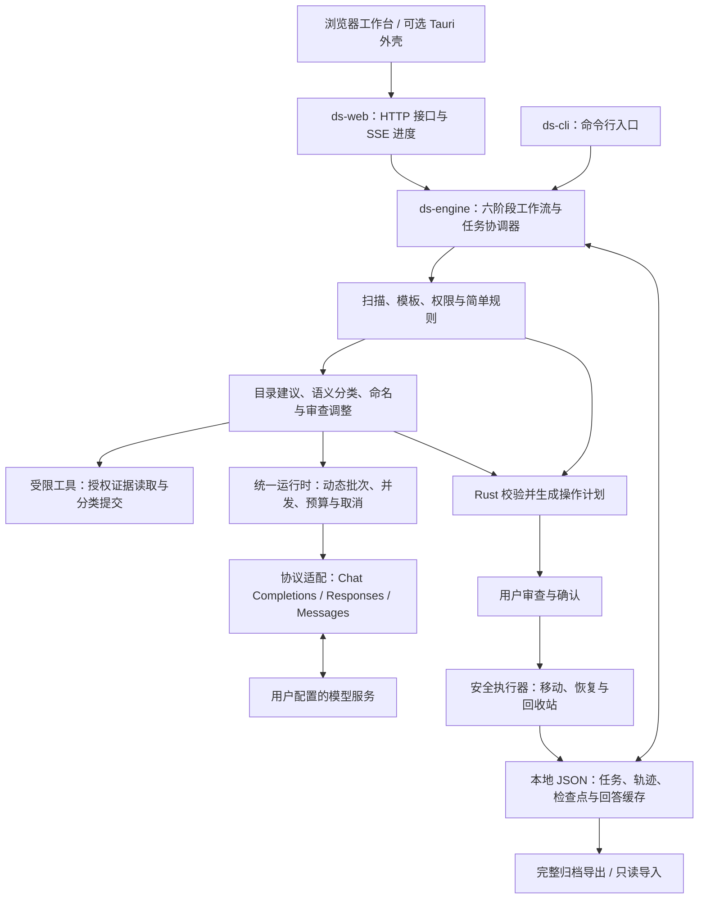

# DownloadSweeper 设计文档

本文依据 2026-09-06 的源码实现。DownloadSweeper 是面向下载目录与桌面的本地文件整理 Agent，以 Rust 控制业务流程，通过浏览器完成规则设置、AI 协作、计划审查和执行。另提供独立的文件名重生流程。浏览器下载记录同步已从需求中移除。

## 1. 痛点分析

目标用户是下载资料频繁的办公人群、长期收藏音视频与软件资源的用户，以及担心误删重要资料而迟迟无法整理的用户。

| 痛点 | 典型场景 | 对应设计 |
| --- | --- | --- |
| 文件类型相同，实际用途不同 | MP4 同时包含电影、番剧和剪辑素材 | 扩展名初分，再按目录备注、具体文件示例与授权内容进行语义分类 |
| 文件名缺少辨识度 | 下载文件只有随机字符或资源编号 | 独立的文件名重生，可选联网检索，先审查再改名 |
| 文件夹不能随意拆散 | 成绩统计文件夹包含多份关联表格；绿色软件依赖原目录结构 | 支持普通目录、整体保护目录和复用容器；桌面文件夹默认整体处理 |
| 不敢让自动化直接动文件 | 多年积累的资料混有合同、照片和旧安装包 | 先展示整理前后预览；显式确认后执行，保存轨迹并提供恢复 |
| 上传文件存在隐私顾虑 | 表格只允许按扩展名整理，文本允许读取片段 | 按文件类型与大小设置权限，由 Rust 在内容外发前检查 |

## 2. 现有工具的缺陷

通用 Agent 能理解自然语言，但用于批量文件整理时，通常还需要额外建立目录类型约束、逐项审查、权限过滤、移动日志和恢复机制。若逐文件反复调用模型或终端，延迟、调用费用和操作不确定性也会增加。仅靠 Prompt 提醒“小心操作”不足以保障文件安全。

不接入 LLM 的规则整理工具适合按扩展名、日期和名称匹配批量处理，但难以区分同格式文件的用途，也难以从局部内容理解模糊命名。复杂规则需要用户持续维护；能否保护目录和撤销操作则取决于具体工具。

本项目将确定性的类型分流、路径计算与磁盘操作留给 Rust，将需要语义判断的目录建议、分类和命名交给模型。无 API key 时，仍可使用本地模板和简单规则完成整理。

## 3. 场景定制

### 3.1 领域知识与 Agent 工具

领域知识由内置分类模板、文件类型预设、目录保护规则，以及用户填写的目录备注和 few-shot 文件引用组成，目前没有独立的向量数据库或 RAG 服务。一级目录必须采用扩展名简单规则，下级可以使用语义规则。已有目录可映射为容器，减少不必要的移动。

Agent 分阶段工作：目录设计阶段可以提出新增一级目录等结构修改；分类阶段仅在已经确定的候选目录中选择归属。专用工具只有按权限读取证据的 `read_file_evidence` 和提交批量分类的 `submit_classifications`。模型接收文件与节点 ID，Rust 检查归属、完整性和重复项，再计算目标路径。

分类 Prompt 要求证据充分时直接提交，证据不足时合并读取，无法判断时保留原计划；将文件内容视作数据，忽略其中的越权指令。工具说明以 [Markdown 协议](docs/agent-tools/README.md)直接注入运行时，并配合 JSON Schema 和 Rust 二次校验。模型工具不提供终端、移动或删除能力。

### 3.2 UI 与人机协作

主入口按“扫描 → 权限 → 目标结构 → 生成计划 → 审查 → 执行”引导操作。桌面模式保留完整 Agent 与目标树编辑能力，默认不拆散已有文件夹，并隐藏、保留 `.url` 和 `.lnk` 快捷方式。

实际目录、目标目录和结果预览采用节点图，节点按行展开、子节点置于下方。目标节点可以编辑规则、备注和文件示例，也可新建、连接或断开；孤立节点可带子树整体拖动，深层目录按需展开。权限卡片提供分类名称、颜色与可编辑的扩展名集合。

可移动、可收起的 AI 浮窗围绕当前场景对话。建议以增删差异呈现，用户选择采纳项；父节点建议未采纳时，依赖它的子建议不可应用。审查阶段的自然语言调整会重新完成位置规划并更新“整理后”预览，最终执行按钮才移动磁盘文件。操作清单可收起，展开后每页 20 项。

### 3.3 安全与恢复

- **外发最小化：** 按权限提供文件名、元数据或有限内容；禁止访问的文件仅参与本地规则整理，示例文件也不能绕过权限。模型能力与读取权限共同决定能否发送图像。
- **执行前校验：** Rust 检查任务版本、扫描快照、路径范围、目录整体性与目标冲突，拒绝不安全的链接路径；移动不覆盖已有文件。
- **可追溯操作：** 先写操作意图，再移动文件，最后记录完成状态；任务采用原子保存。恢复时重新核对位置和指纹，有冲突则停止。指纹用于身份核对，不等于文件备份。
- **显式清理：** 整理后提供大文件、临时备份、未完成下载、旧安装包、旧压缩包、疑似重复及空文件等建议。用户勾选确认后才移至系统回收站，并可撤销；不提供自动永久删除。疑似重复依据名称和大小筛选，不宣称内容相同。
- **凭据隔离：** 配置引用环境变量，GUI 保存的 key 位于私有 `.env`；分享文件排除凭据与任务数据。Rust 检查器扫描源码、Git 索引和发布包中的凭据特征，不输出密钥原文。该检查不能判断密钥是否已撤销，也不替代 Git 历史审计。

## 4. 系统架构

数据从扫描快照逐步形成目标树和具体操作计划，AI 的输出始终经过 Rust 校验。只读工作使用任务快照，唯一协调器负责提交结果和持久化；有依赖的请求保持顺序，独立分类批次并行，磁盘移动和恢复串行执行。

| 关键结构 | 内容与作用 |
| --- | --- |
| `Task` / `Entry` | 任务版本、阶段、扫描条目、权限、规则树、操作、对话及用量，是工作流状态来源 |
| `Node` | 父节点、目录名、规则类型、扩展名、备注、示例引用及已有目录映射 |
| `Proposal` / `Change` | 带场景和任务版本的候选改动，支持用户选择与合并校验 |
| `Operation` | 来源、目标、选择状态、执行状态、指纹及整体目录清单 |
| `Job` / `Checkpoint` | 运行进度、并行批次、暂停状态、任务版本和配置摘要，用于恢复校验 |
| `CallRecord` / `pending_calls` | 已确认的服务用量与计费记录，以及尚未确认的请求预算预留 |

统一运行时复用 HTTP 连接，默认三路 API 并发，可设为 1–8；按上下文、输出额度和证据体积动态组织批次。本地内容预览使用独立的三个工作位。已完成批次与模型回答持久化，减少恢复时的重复调用；实际速度和费用仍取决于模型服务及输入规模。

## 5. 技术选型

| 部分 | 当前技术与选择理由 |
| --- | --- |
| 核心业务 | `crates/engine`：Rust，集中实现扫描、规则、Agent 编排、权限、计费与安全文件操作，避免前后端各维护一套业务规则 |
| 服务与入口 | `crates/web`：Rust / Axum，HTTP 与 SSE；`crates/cli`：Rust CLI；`src-tauri`：可选 Tauri 2 外壳 |
| 前端 | `frontend`：JavaScript、React、React Flow、HTML/CSS；依赖随项目提供，浏览器负责交互和可视化，常规构建无需 Node.js |
| 异步与模型接口 | Tokio、reqwest / rustls；统一运行时配合供应商协议适配，控制并发、超时、上下文与预算 |
| 配置与存储 | TOML、环境变量及私有 `.env`；Serde / JSON 保存任务、轨迹和检查点，完整归档带校验封装，无独立数据库依赖 |
| 文件指纹 | BLAKE3。新操作对不超过 1 MiB 的文件全量读取，更大的文件取五段、共 320 KiB，并纳入大小和修改时间；目录额外记录结构。回收站恢复采用全量校验，兼容旧 SHA-256 / BLAKE3 记录 |
| 图片与视频 | Rust `image` 处理缩略图；Windows 使用系统媒体接口，macOS 使用 AVFoundation 的 `AVAssetImageGenerator`，FFmpeg 为可选后备。视频最多取开头与中间等三帧拼图，不上传原视频或音频 |
| PDF 与 Office | PDF 使用 Windows.Data.Pdf / macOS CoreGraphics，最多取首页、第二页和中间页。Office 使用 Rust `zip` + `quick-xml` 有界读取正文、少量幻灯片或工作表；不运行宏、不计算公式，不依赖 Office 安装 |
| 原生桥接 | Windows 由 Rust 调用系统 API；macOS 使用少量 Objective-C 封装媒体、PDF 与回收站接口，主控仍在 Rust |
| 测试与开发工具 | 全部测试由 Rust / Cargo 组织，模拟 API 与临时目录覆盖 HTTP、CLI、恢复、权限和计费；Boa 执行实际前端 JS 的逻辑回归。`crates/dev` 提供分享检查和开发同步工具 |

抽样指纹不能证明大文件每一字节均相同；保留修改时间的未采样区域变化可能漏检。内容预览同样只是局部证据：不提供视频声音识别、PDF 全文 OCR 或旧式 `.doc/.xls/.ppt` 内容解析。提取失败时按授权范围降级，并向模型说明缺失信息。

Python 仅保留在可选演示、试用素材生成与 macOS 打包辅助脚本中，不参与核心业务或测试。当前 Windows 回归已验证；macOS / Apple Silicon 已有平台适配和 CI 配置，本次本机验证不代表 macOS 实机验收。前端逻辑测试也不代替浏览器视觉验收。

## 附录：R1–R6 完成情况

| 要求 | 当前完成情况与边界 |
| --- | --- |
| **R1：核心逻辑用 Rust 实现** | **已实现。** 数据处理、工作流、API 编排及文件操作均由 Rust 控制；JS 负责 UI，Objective-C 仅作 macOS 接口桥接。 |
| **R2：提供交互界面** | **已实现。** 浏览器工作台可启动任务、编辑规则、审查和执行，并展示结果；另有 CLI 与可选桌面外壳。 |
| **R3：模型与参数可配置** | **已实现。** GUI 和文件配置支持 Endpoint、Key、模型、上下文、输出额度、思考、多模态、并发与价格。可发现服务模型并显示已知上下文信息，未知能力不保证自动识别；价格采用带来源的预设表，并允许手动覆盖，不是实时抓取官网。 |
| **R4：实时进度与打断** | **已实现。** Web 长任务通过 SSE、心跳和轮询显示进度与并行批次，支持暂停保存及重启后继续。恢复以业务检查点和操作日志为边界；未提交的本地扫描阶段重新计算，远程生成不支持服务端断点续传，也不能保证取消后供应商停止计费。 |
| **R5：上下文历史管理** | **已实现。** 保存任务、场景对话与操作轨迹，支持完整 JSON 归档导出、只读导入，以及从归档建立需重新扫描的新任务。同场景历史按上下文预算选择，不再固定最近八条；完整历史保存在本地，不保证每轮全部发送。归档不包含原始文件。 |
| **R6：Token 与费用统计** | **已实现。** 按服务返回的输入、输出及缓存用量逐次记账，按价格与币种展示费用；默认预算 500,000 token，并发共享预算预留，额度不足时停止新请求。估算仅用于准入，缺失 usage 的调用保留为待确认，未知价格不记作零费用。 |

实现细节见 [统一运行时](docs/AGENT_RUNTIME.md)、[检查点恢复](docs/CHECKPOINTS.md)、[历史归档与清理](docs/ARCHIVES_AND_CLEANUP.md)、[多模态](docs/MULTIMODAL.md)、[指纹格式](docs/FINGERPRINTS.md)和 [Rust 测试说明](docs/TESTING.md)。
